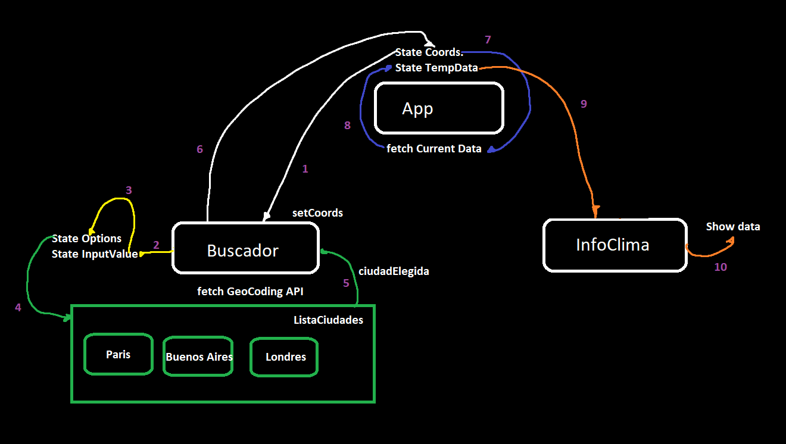

# Mini-Project - ClimaAPI - 2024

## Page that allows you to search for the city you want, and it informs you of the current weather data for it.

I did this project to practice the connection with an agent external to my website, in this case, it is an API that, through the GET method, gives you the current meteorological data of the city you want. Also to practice with the useEffect hook. The API is called [OpenWeather](https://openweathermap.org/) and has different services. For this page I used 2 **free** services that complement each other (also the API recommends that you use them together):

- The first service is [GeoCoding API](https://openweathermap.org/api/geocoding-api). It helped me to return the coordinates (latitude and longitude) of the city through the user's search.
- The second service is [Current Weather Data](https://openweathermap.org/current), this needs the coordinates of the city to give you the weather conditions in the area.

**These 2 services were necessary for me to use since one gives me the coordinates through the name of the city so that the other can give me the meteorological data.**

### Graphic Idea

**How my page works in general terms:**



---

## Preview

**_Later when I make the design_**

---

### How to use this page

- Install [Node](https://nodejs.org/en) and [Git](https://git-scm.com/downloads).
- Clone this repository in a terminal:

```
git clone https://github.com/Facundototo/MiniProyecto-ClimaAPI.git
```

- Go to the root folder of the project and start the page:

```
cd clima-api-react
npm run dev
```

- It will give you a link, copy it to the web and that's it.

---

## Things I need to finish

- [ ] Make some cards through the search and you can click the city you want.
- [x] Find a way to not show repeated cities.
- [ ] Make **design** (CSS).
- [ ] Show well the data taken from the API.

---

## Commits

The tracking of what I was doing in each commit is within this [file](https://github.com/Facundototo/MiniProyecto-ClimaAPI/blob/main/Commits.md)

---
