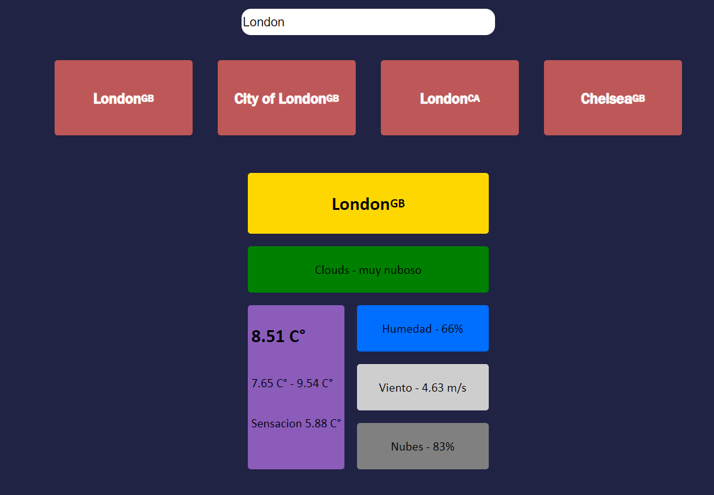

# Mini-Proyecto - ClimaAPI - 2024

> [_README IN ENGLISH_](https://github.com/Facundototo/MiniProyecto-ClimaAPI/blob/main/README-English.md)

## Pagina que te permite buscar la ciudad que quieras, y esta te informa de los datos meteorologicos actuales de la misma.

Este proyecto lo hice para practicar la conexion con un agente externo a mi web, en este caso, es una API que a traves del metodo GET te da los datos meteorologicos actuales de la ciudad que quieras. Tambien para practicar con el hook useEffect. La API se llama [OpenWeather](https://openweathermap.org/) y tiene diferentes servicios. Para esta pagina utilice 2 servicios **gratuitos** que se complementan entre si (ademas la API te recomienda que los uses juntos):

- El primer servicio es [GeoCoding API](https://openweathermap.org/api/geocoding-api). Me sirvio para que me retorne a traves de la busqueda del usuario las coordenadas (latitud y longitud) de la ciudad.
- El segundo servicio es [Current Weather Data](https://openweathermap.org/current), este necesita las coordenadas de la ciudad para darte las condiciones meteorologicas de la zona.

Estos 2 servicios me eran necesarios usarlos ya que uno me da las coordenadas a traves del nombre de la ciudad para que el otro me de los datos meteorologicos.

### Idea Grafica

**Como funciona mi pagina en terminos generales:**


---

## Vista Previa



---

### Como usar esta pagina

- Instalar [Node](https://nodejs.org/en) y [Git](https://git-scm.com/downloads).
- Clonar este repositorio en una terminal:

```
git clone https://github.com/Facundototo/MiniProyecto-ClimaAPI.git
```

- Meterse en la carpeta raiz del proyecto e iniciar la pagina:

```
cd <carpeta-raiz>
npm run dev
```

- Te va a dar un link, copialo en la web y listo.

---

## Cosas que me faltan para terminar

- [x] Hacer a traves de la busqueda unas cards y que pueda clickear la ciudad que quiera.
- [x] Encontrar una forma de no mostrar las ciudades repetidas.
- [x] Hacer **diseño** (CSS).
- [x] Mostrar bien los datos sacados de la API.

---

## Commits

El seguimiento de lo que fui haciendo en cada commit esta dentro de este [archivo](https://github.com/Facundototo/MiniProyecto-ClimaAPI/blob/main/Commits.md)

---
